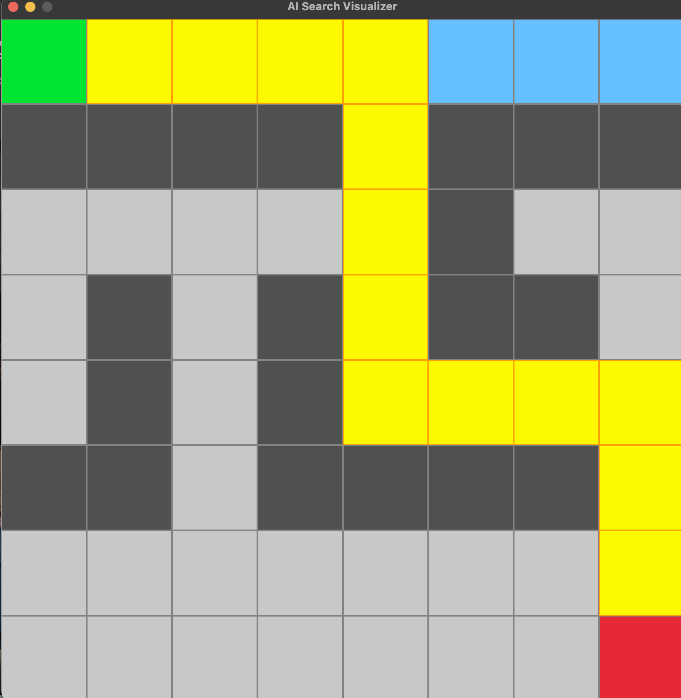
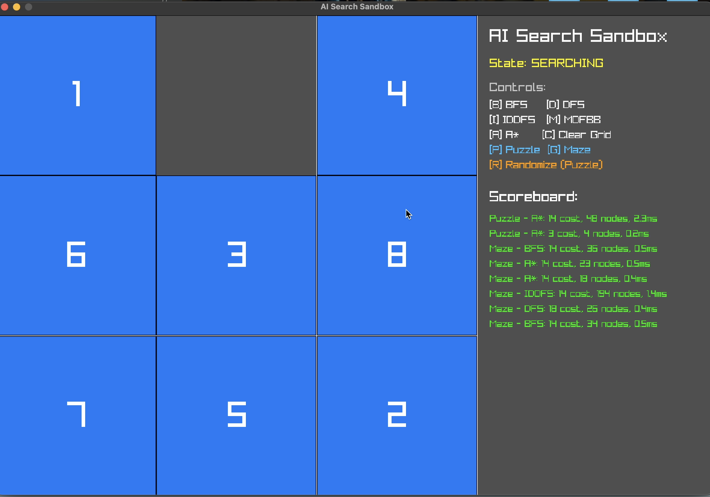
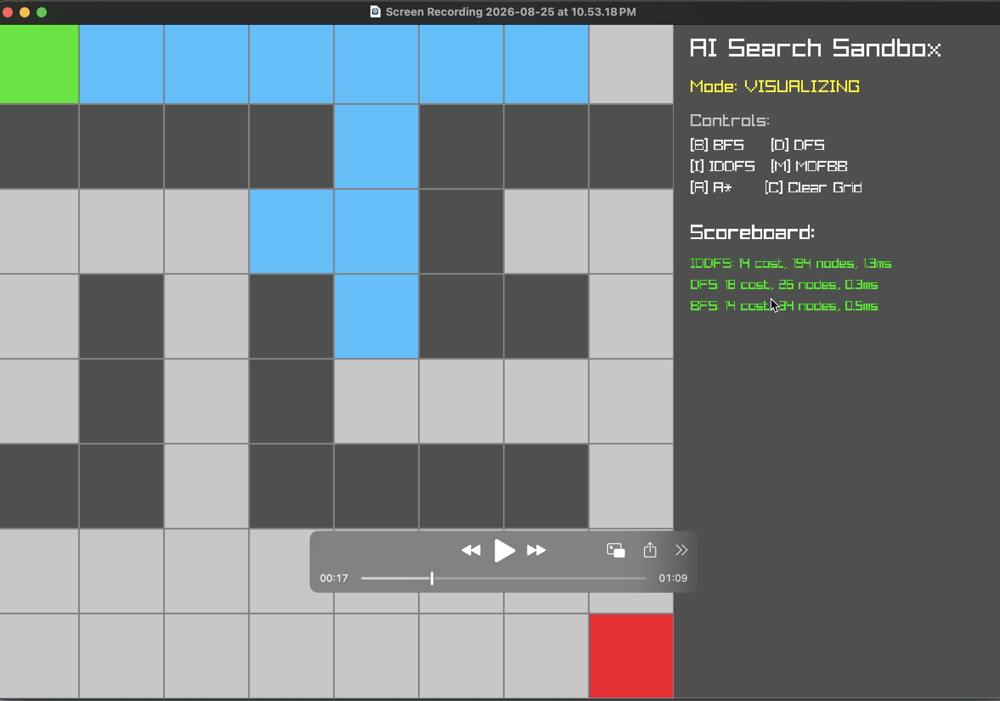

# AI Search Sandbox

An interactive visualizer built in C++ with Raylib to demonstrate and benchmark Artificial Intelligence search algorithms (BFS, DFS, IDDFS, MDFBB, and A*). It supports solving grid-based Mazes and the classic 8-Puzzle problem with full UI interactivity.

## Features

- **Multiple Algorithms**: Compare Breadth-First Search, Depth-First Search, Iterative Deepening DFS, Memory-Bounded Depth-First Branch and Bound, and A* Search.
- **Interactive Maze Editing**: Click and drag to draw or erase walls in real-time.
- **8-Puzzle Support**: Click to slide tiles interactively, or randomize the board into a solvable state.
- **Live Visualization**: Watch the algorithms explore the state space in real-time.
- **Performance Scoreboard**: Compare Path Cost, Nodes Expanded, and Execution Time between different algorithms.

## Media

### Maze Pathfinding


### 8-Puzzle Interface


### Algorithm Benchmarking


### Video Demonstration
[Watch Demo Video](demo.mov)

## Dependencies
- C++17
- CMake 3.14+
- Raylib (Automatically fetched via CMake)

## Build Instructions

```bash
mkdir build
cd build
cmake ..
make
./SearchLab
```

## Controls
- `[P]` Switch to Puzzle Mode
- `[G]` Switch to Maze Mode
- `[B]` Run BFS
- `[D]` Run DFS
- `[I]` Run IDDFS
- `[M]` Run MDFBB
- `[A]` Run A* Search
- `[C]` Clear Grid / Reset State
- `[R]` Randomize Puzzle Board
- `Left Click` Toggle maze walls / slide puzzle tiles
